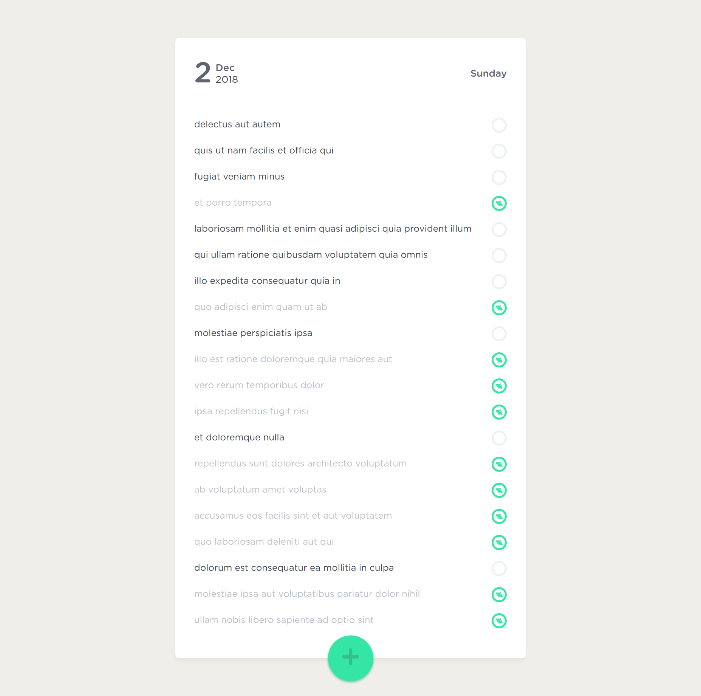

# To-do list

`Актуальная версия в ветке dev, здесь более старая с использованием localStorage`

[demo](https://mendagazievb.github.io/todo/)



## Project setup
```
npm install
```

### Compiles and hot-reloads for development
```
npm run serve
```

### Compiles and minifies for production
```
npm run build
```
